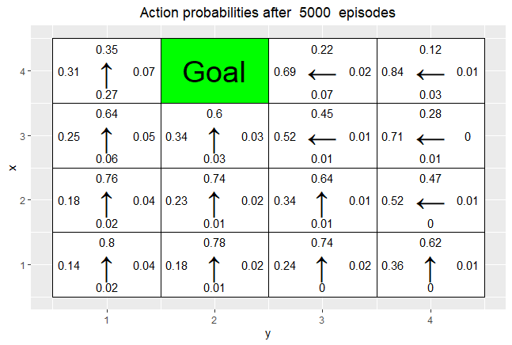
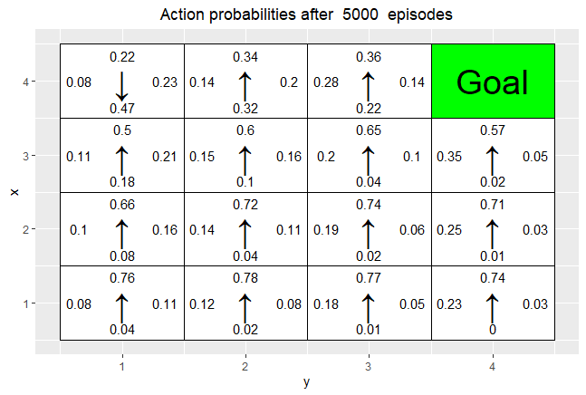
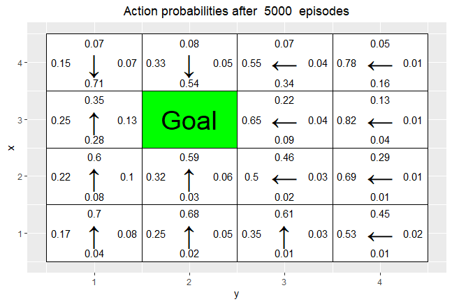
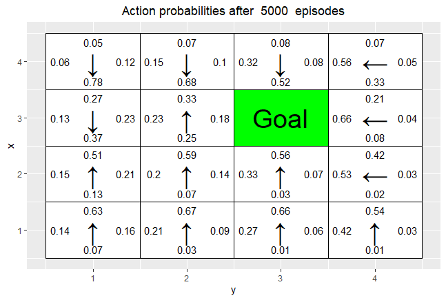
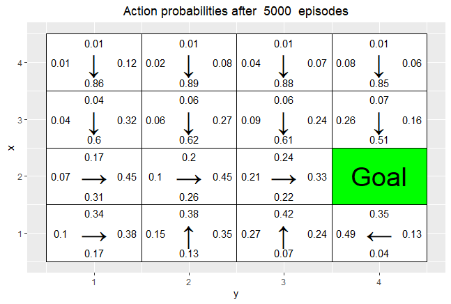
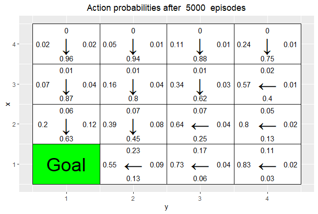
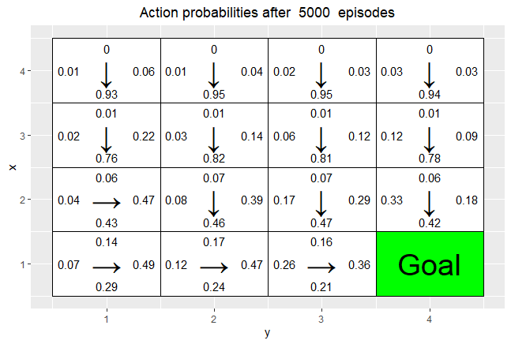
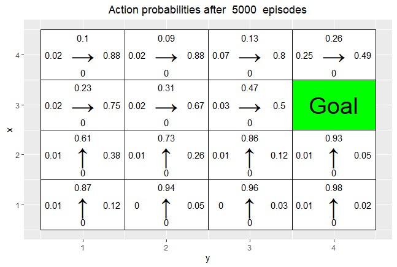
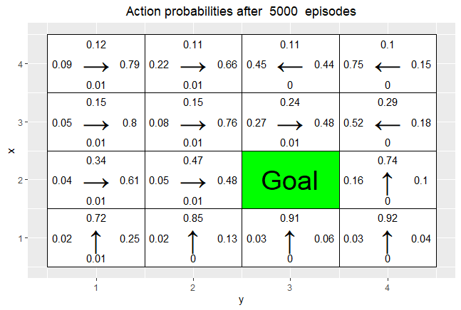
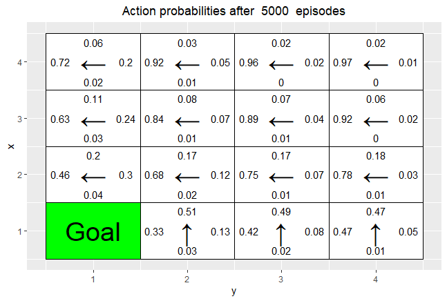

```{r setup, include=FALSE}
knitr::opts_chunk$set(echo = TRUE)
```

Q-Table is a data structure which allows for the calculation of the maximum expected future rewards for actions at each state folling the shape of [state, action]. We start by initalilizing all values to zero and gradually update the table by computing new q-values and updating the q-table. The table then becomes a reference table which allows or the agent to select the best action at each state based on the q-value. 

The Q-values are computed by using the Bellman equation and akes two inputs, state (s) and action (a) aond computes the different q-values for a particular state and action based on the expected discounted cumulative reward. After each move that the agen makes the q-values are computed using the bellman equation and the q-table is update

Epsilon greedy strategy: In the beginning the epsilon rate will be higher causing the agent to explore the environment and randomly choosing actions but as the agent explores the environment the epsilon rate gradually decreases and the agent starts to exploit the environment. During this process of exploration the agent becomes more confident in the estimation of the q-values (estimated future rewards) and can start exploiting it in order to make better decisions. 

Having selected an action causing in the agent to move we can then observe the outcome and reward. Next step after this is completed is to update the Q-values through the q-function. In this tay the Q-table is updated and the value function is maximized. Q(state, action) returns the expected future return of the action a at state s

```{r , echo=FALSE, fig.cap="A caption", out.width = '60%'}
knitr::include_graphics("bellman_update.png")
```

By applying max we are taking max of the future reward and applying it to the current action. In other words, allocating future reward to current action in order to help the agent select the highest return action at any given state. This is one of the big advantages of q-learning since it impacts the current action by possible future reward instead of only looking at the immedeate. 

## Environment A

*What has the agent learned after 10 episodes?*
The agent starts in position (3,1) and after having gone 10 episodes we see that the agent manages to avoid the negative rewards by setting negative q-values on the states which it has visited. However being a very
```{r 10, echo = FALSE, out.width='40%'}
knitr::include_graphics("10.png")

```

As the episodes increase we see how the agent gets better and better and the q values start to converge. The agent can therfore use the q-table to better maximize the reward. Already by 100 episodes all final arrows close to the reward point in the correct direction.
```{r,echo=FALSE, out.width='40%'}
knitr::include_graphics("100.png")
knitr::include_graphics("1000.png")

```

*Is the final greedy policy after 10000 episodes optimal ?*
Q-learning is guaranted
Q-learning är garanterad att konvergera mot, måste minska learning rate mot 0 - tile går mot 9.

Using 10000 iteration we see that the whole grid has been explored since all states have q-values. If this is optimal or not isnot clear to say since it depends on how we define optimal. Comparing for example the final grid (100000) vs (1000) it will reach the goalin the same number of steps but the 10000 would be more costly. Is it better since it gets a higher total reward? does it?
```{r 1000,echo=FALSE, out.width='40%'}
knitr::include_graphics("10000.png")
```


*Does the agent learn multiple paths to get a positive  reward? If not, what could be done to make the agent learn this?*

If only looking at the final grid there is only 1 path which can be taken. In order to make the agent find more ways you could for example increase the epsilon value making the agent explore mor paths or by increasing the Beta value causing the agent to go a different way?
```{r 10000, echo = FALSE, out.width='40%'}
knitr::include_graphics("10000.png")
```

# 2.3
## Environment B

*This is a 7×8 environment where the top and bottom rows have negative rewards. In this environment, the agent starts each episode in the state (4, 1). There are two positive rewards, of 5 and 10. The reward of 5 is easily reachable, but the agent has to navigate around the first reward in order to find the reward worth 10. Your task is to investigate how the epsilon and γ parameters affect the learned policy by running 30000 episodes of Q-learning with epsilon = 0.1, 0.5, γ = 0.5, 0.75, 0.95, β = 0 and α = 0.1. To do so, simply run the code provided in the file RL Lab1.R and explain your observations*

Reward: Reward is stated as the value received after having completed a certain action given a certain state. A reward cain either happen at any given time step or only at the terminal step

Exploiting: Exploiting is when the agent interacts with the environment by looking at the q-table to determine action based on max value of the action.

Exploring: Similar to exploiting, but instead of always choosing aciton based on max future reward  we include the posssibility for an action at random which then allows for the agent to explore and discover new states which would not have been found using a greedy algorithm (Exploiting)

Epsilon: Epsilon states the balance between explore/exploit, meaing with what probability we want to choose the action with largest future reward or choose an action at random 

Gamma: Gamma is a discount factor which is used in order to determine how we want the model to value immedeate contra future reward. By applying the this factor [0,1] to the future reward we can therfore shrink the importance of the future reward. If gamma = 1 then the future reward is valued the same as immedeate.

*What effect does epsilon and gamma parameters have on the learned policy?*
#1. epsilon = 0.5, alpha = 0.1, gamma = c(0.5, 0.75, 0.95), Beta = 0
#2: epsilon = 0.1: alpha = 0.1, gamma = c(0.5, 0.75, 0.95), Beta = 0

As stated above, epsilon will determine the ratio for which the agent chooses to exploit the action holding the largest reward and when it instead chooses a random action. Epsilon 0.5 wil result in that it chooses a random action 50 % of the time and should consequently result in a larger amount of exploration in comparision with epsilon 0.1. Gamma is the discounting factor which determine how much value future rewards are to be given contra immedeate.A lower gamma value will consequently result in a more greedy strategy where the agent prefers the immedeate returns over the future returns. A higher gamma value i.e 0.95 shouuld instead result in a more thoughtful path where the agent takes in to account the expected future return. Without any consideration of cost in terms of computationtime I would belive that epsilon 0.5 and gamma 0.95 would result in the best result where the agent finds both of the rewards. 


```{r , echo=FALSE, fig.cap="A caption", out.width = '40%'}
knitr::include_graphics("environment2.png")
```
This grid is tricky since the agent has to learn to not stop once it has found the first reward of 5 but continue the search. 

The previous argument can be verified in the example below which shows the impact of gamma. As gamma is lower 0.5 the agent stops at the first reward it finds 5. This is due to that it does not take it does not value as much the expected future reward as much as the immedeate. When gamma 0.95 the agent will however find the 10 instead of getting stuck in the local optimum. 

```{r , echo=FALSE, fig.cap="A caption", out.width = '40%'}
knitr::include_graphics("0.50.5.png")
knitr::include_graphics("0.50.95.png")
```

In the example below we are comparing for the case when epsilon is fixed 0.1 meaning that the agent should be expliting rather than exploring. When gamma 0.5 we again observe the problem of the agent getting stuck in the local minimum since it does not value expected future rewards as much. Furthermore having a very low epsilon causes it to be very greedy and not exploring new paths. When gamma is increased to 0.95 the agent begins to discover more.

```{r , echo=FALSE, fig.cap="A caption", out.width = '40%'}
knitr::include_graphics("0.10.5.png")
knitr::include_graphics("0.10.95.png")
```


```{r, echo=FALSE, fig.cap="A caption", out.width = '40%'}
knitr::include_graphics("reward0505.png")
knitr::include_graphics("reward0595.png")
```

```{r, echo=FALSE, fig.cap="A caption", out.width = '40%'}
knitr::include_graphics("correction0505.png")
knitr::include_graphics("correction0595.png")
```


```{r, echo=FALSE, fig.cap="A caption", out.width = '40%'}
knitr::include_graphics("reward0105.png")
knitr::include_graphics("reward0195.png")
```

```{r, echo=FALSE, fig.cap="A caption", out.width = '40%'}
knitr::include_graphics("correction0105.png")
knitr::include_graphics("correction0195.png")
```


#2.4
#Environment C

*This is a smaller 3×6 environment. Here the agent starts each episode in the state (1,1). Your task is to investigate how the β parameter affects the learned policy by running 10000 episodes of Q-learning with β = 0, 0.2, 0.4, 0.66, epsilon = 0.5, γ = 0.6 and α = 0.1. To do so, simply run the code provided in the file RL Lab1.R and explain your observations.*


Beta: The agent will follow the action with probability (1-beta) and slip to the right or left with probability beta/2 each.Beta is defined as tha probability of the agent slipping to the side (unintended direction) when trying to move. As beta increases we can se how the agent learns to favour directions which don't risk getting the negative reward.


```{r, echo = FALSE, out.width='40%'}
knitr::include_graphics("beta0.png")
knitr::include_graphics("beta06.png")
```

#2.5
*REINFORCE. The file RL Lab2.R in the course website contains an implementation of the REINFORCE algorithm.2 Your task is to run the code provided and answer some questions. Although you do not have to modify the code, you are advised to check it out to familiarize with it. The code uses the R package keras to manipulate neural networks. We will work with a 4 × 4 grid. We want the agent to learn to navigate to a random goal position in the grid. The agent will start in a random position and it will be told the goal position. The agent receives a reward of 5 when it reaches the goal. Since the goal position can be any position, we need a way to tell the agent where the goal is. Since our agent does not have any memory mechanism, we provide the goal coordinates as part of the state at every time step, i.e. a state consists now of four coordinates: Two for the position of the agent, and two for the goal position. The actions of the agent can however only impact its own position, i.e. the actions do not modify the goal position. Note that the agent initially does not know that the last two coordinates of a state indicate the position with maximal reward, i.e. the goal position. It has to learn it. It also has to learn a policy to reach the goal position from the initial position. Moreover, the policy has to depend on the goal position, because it is chosen at random in each episode. Since we only have a single non-zero reward, we do not specify a reward map. Instead, the goal coordinates are passed to the functions that need to access the reward function.*

#2.6
#Environment D

*In this task, we will use eight goal positions for training and, then, validate the learned policy on the remaining eight possible goal positions. The training and validation goal positions are stored in the lists train goals and val goals in the code in the file RL Lab2.R. You are requested to run the code provided, which runs the REINFORCEalgorithm for 5000 episodes with β = 0 and γ = 0.95. Each training episode uses a random goal position from train goals. The initial position for the episode is also chosen at random. When training is completed, the code validates the learned policy for the goal positions in val goals. This is done by with the help of the function vis prob, which shows the grid, goal position and learned policy. Note that each non-terminal tile has four values. These represent the action probabilities associated to the tile (state). Note also that each non-terminal tile has an arrow. This indicates the action with the larg*


*Has the agent learned a good policy?*

Looking at the results below which is based on a policy created by a neural network it appears that the result has learned a good policy. By not having to iterate over and compute the q-table the computations are done alot faster and the result achieved is still very good. It does however result in cases where the agent does not find the reward even though it it right next to it.

```{r , echo = FALSE, out.width='10%'}
par(mfcol = c(1,4))









```

*Could you have used the Q-learning algorithm to solve this task?*
The Q-learning model would not be able to generalize since it does not work well for moving targets. It will train well for 1 goal but then as the goal is switched it will not work well.

Reinforcement will take in goal state as a part of it's input and learn a funciton based on this. Q learning on the other hand will not take in a

#2.7
#Environment E

*You are now asked to repeat the previous experiments but this time the goals for training are all from the top row of the grid. The validation goals are three positions from the rows below. To solve this task, simply run the code provided in the file RL Lab2.R and answer the following questions:*

*Has the agent learned a good policy?*

No the agent has not learned a good policy. Since it is only trained on data having the goal placed on the top row it has made a policy accordingly and will not be able to change this. Consequently, the agent never makes a movement which makes it go in a downwards direction. 
```{r, echo = FALSE, out.width = '40%'}



```

*If the resuls obtained for environments D and E differ, explain why*
The results differ since they are based on different datapoints as goal since D uses a random goal while E only use goals on the top  row


# CODE
```{r, include = FALSE, echo = TRUE}
# By Jose M. Peña and Joel Oskarsson.
# For teaching purposes.
# jose.m.pena@liu.se.

#####################################################################################################
# Q-learning
#####################################################################################################

#install.packages("ggplot2")
#install.packages("vctrs")
library(ggplot2)
library(vctrs)

# If you do not see four arrows in line 16, then do the following:
# File/Reopen with Encoding/UTF-8

arrows <- c("↑", "→", "↓", "←")
action_deltas <- list(c(1,0), # up
                      c(0,1), # right
                      c(-1,0), # down
                      c(0,-1)) # left

vis_environment <- function(iterations=0, epsilon = 0.5, alpha = 0.1, gamma = 0.95, beta = 0){
  
  # Visualize an environment with rewards. 
  # Q-values for all actions are displayed on the edges of each tile.
  # The (greedy) policy for each state is also displayed.
  # 
  # Args:
  #   iterations, epsilon, alpha, gamma, beta (optional): for the figure title.
  #   reward_map (global variable): a HxW array containing the reward given at each state.
  #   q_table (global variable): a HxWx4 array containing Q-values for each state-action pair.
  #   H, W (global variables): environment dimensions.
  
  df <- expand.grid(x=1:H,y=1:W)
  foo <- mapply(function(x,y) ifelse(reward_map[x,y] == 0,q_table[x,y,1],NA),df$x,df$y)
  df$val1 <- as.vector(round(foo, 2))
  foo <- mapply(function(x,y) ifelse(reward_map[x,y] == 0,q_table[x,y,2],NA),df$x,df$y)
  df$val2 <- as.vector(round(foo, 2))
  foo <- mapply(function(x,y) ifelse(reward_map[x,y] == 0,q_table[x,y,3],NA),df$x,df$y)
  df$val3 <- as.vector(round(foo, 2))
  foo <- mapply(function(x,y) ifelse(reward_map[x,y] == 0,q_table[x,y,4],NA),df$x,df$y)
  df$val4 <- as.vector(round(foo, 2))
  foo <- mapply(function(x,y) 
    ifelse(reward_map[x,y] == 0,arrows[GreedyPolicy(x,y)],reward_map[x,y]),df$x,df$y)
  df$val5 <- as.vector(foo)
  foo <- mapply(function(x,y) ifelse(reward_map[x,y] == 0,max(q_table[x,y,]),
                                     ifelse(reward_map[x,y]<0,NA,reward_map[x,y])),df$x,df$y)
  df$val6 <- as.vector(foo)
  
  print(ggplot(df,aes(x = y,y = x)) +
          scale_fill_gradient(low = "white", high = "green", na.value = "red", name = "") +
          geom_tile(aes(fill=val6)) +
          geom_text(aes(label = val1),size = 4,nudge_y = .35,na.rm = TRUE) +
          geom_text(aes(label = val2),size = 4,nudge_x = .35,na.rm = TRUE) +
          geom_text(aes(label = val3),size = 4,nudge_y = -.35,na.rm = TRUE) +
          geom_text(aes(label = val4),size = 4,nudge_x = -.35,na.rm = TRUE) +
          geom_text(aes(label = val5),size = 10) +
          geom_tile(fill = 'transparent', colour = 'black') + 
          ggtitle(paste("Q-table after ",iterations," iterations\n",
                        "(epsilon = ",epsilon,", alpha = ",alpha,"gamma = ",gamma,", beta = ",beta,")")) +
          theme(plot.title = element_text(hjust = 0.5)) +
          scale_x_continuous(breaks = c(1:W),labels = c(1:W)) +
          scale_y_continuous(breaks = c(1:H),labels = c(1:H)))
  
}

GreedyPolicy <- function(x, y){
  
  # Get a greedy action for state (x,y) from q_table.
  #
  # Args:
  #   x, y: state coordinates.
  #   q_table (global variable): a HxWx4 array containing Q-values for each state-action pair.
  # 
  # Returns:
  #   An action, i.e. integer in {1,2,3,4}.
  
  # Your code here.
  move = which(q_table[x,y,] == max(q_table[x,y,]))
  if(length(move) > 1){
    return(sample(move,1))
  }
  else{
    return(move)
  }
}

EpsilonGreedyPolicy <- function(x, y, epsilon){
  
  # Get an epsilon-greedy action for state (x,y) from q_table.
  #
  # Args:
  #   x, y: state coordinates.
  #   epsilon: probability of acting randomly.
  # 
  # Returns:
  #   An action, i.e. integer in {1,2,3,4}.
  
  # Your code here.
  if (runif(1,0,1) > epsilon){
    return(GreedyPolicy(x,y))
  }
  else{
    return(sample(4,1))
  }
}

transition_model <- function(x, y, action, beta){
  
  # Computes the new state after given action is taken. The agent will follow the action 
  # with probability (1-beta) and slip to the right or left with probability beta/2 each.
  # 
  # Args:
  #   x, y: state coordinates.
  #   action: which action the agent takes (in {1,2,3,4}).
  #   beta: probability of the agent slipping to the side when trying to move.
  #   H, W (global variables): environment dimensions.
  # 
  # Returns:
  #   The new state after the action has been taken.
  
  delta <- sample(-1:1, size = 1, prob = c(0.5*beta,1-beta,0.5*beta))
  final_action <- ((action + delta + 3) %% 4) + 1
  foo <- c(x,y) + unlist(action_deltas[final_action])
  foo <- pmax(c(1,1),pmin(foo,c(H,W)))
  
  return (foo)
}

q_learning <- function(start_state, epsilon = 0.5, alpha = 0.1, gamma = 0.95, 
                       beta = 0){
  
  # Perform one episode of Q-learning. The agent should move around in the 
  # environment using the given transition model and update the Q-table.
  # The episode ends when the agent reaches a terminal state.
  # 
  # Args:
  #   start_state: array with two entries, describing the starting position of the agent.
  #   epsilon (optional): probability of acting greedily.
  #   alpha (optional): learning rate.
  #   gamma (optional): discount factor.
  #   beta (optional): slipping factor.
  #   reward_map (global variable): a HxW array containing the reward given at each state.
  #   q_table (global variable): a HxWx4 array containing Q-values for each state-action pair.
  # 
  # Returns:
  #   reward: reward received in the episode.
  #   correction: sum of the temporal difference correction terms over the episode.
  #   q_table (global variable): Recall that R passes arguments by value. So, q_table being
  #   a global variable can be modified with the superassigment operator <<-.
  
  #qtable holds values for the expected future reward of an action given a certain state
  
  Qstate=start_state
  reward=0
  temporal_difference=0
  
  repeat{
    # Follow policy, execute action, get reward.
    x=Qstate[1]
    y=Qstate[2]
    #Compute what action to take
    action=EpsilonGreedyPolicy(x, y, epsilon)
    #action=GreedyPolicy(x, y)
    #Compute new state after given action
    new_state=transition_model(x, y, action, beta)
    #Extract the reward for the given action with the given state
    reward=reward_map[new_state[1], new_state[2]]
    
    #Temporal difference = R + γ maxQ(S′, a) − Q(S, A) 
    # Q-table update.
    temporal_difference=temporal_difference  + reward+gamma*max(q_table[new_state[1], new_state[2],])
    q_table[x,y,action] <<- q_table[x,y,action] + alpha*(reward + gamma*max(q_table[new_state[1], new_state[2],]) - q_table[x,y,action])
    
    #Update the state coordinates
    Qstate=new_state
    
    if(reward!=0)
      # End episode.
      return (c(reward,temporal_difference))
  }

  }


#####################################################################################################
# Q-Learning Environments
#####################################################################################################

###################### Environment A (learning)
set.seed(12345)
W <- 7
H <- 5

reward_map <- matrix(0, nrow = H, ncol = W)
reward_map[3,6] <- 10
reward_map[2:4,3] <- -1

q_table <- array(0,dim = c(H,W,4))

vis_environment()

for(i in 1:10000){
  foo <- q_learning(start_state = c(3,1))
  
  if(any(i==c(10,100,1000,10000)))
    vis_environment(i)
}
## Environment B (the effect of epsilon and gamma)
#
set.seed(12345)
H <- 7
W <- 8

reward_map <- matrix(0, nrow = H, ncol = W)
reward_map[1,] <- -1
reward_map[7,] <- -1
reward_map[4,5] <- 5
reward_map[4,8] <- 10

q_table <- array(0,dim = c(H,W,4))

vis_environment()

MovingAverage <- function(x, n){
  
  cx <- c(0,cumsum(x))
  rsum <- (cx[(n+1):length(cx)] - cx[1:(length(cx) - n)]) / n
  
  return (rsum)
}

for(j in c(0.5,0.75,0.95)){
  q_table <- array(0,dim = c(H,W,4))
  reward <- NULL
  correction <- NULL
  
  for(i in 1:30000){
    foo <- q_learning(gamma = j, start_state = c(4,1))
    reward <- c(reward,foo[1])
    correction <- c(correction,foo[2])
  }
  
  vis_environment(i, gamma = j)
  plot(MovingAverage(reward,100),type = "l")
  plot(MovingAverage(correction,100),type = "l")
}

for(j in c(0.5,0.75,0.95)){
  q_table <- array(0,dim = c(H,W,4))
  reward <- NULL
  correction <- NULL
  
  for(i in 1:30000){
    foo <- q_learning(epsilon = 0.1, gamma = j, start_state = c(4,1))
    reward <- c(reward,foo[1])
    correction <- c(correction,foo[2])
  }
  
  vis_environment(i, epsilon = 0.1, gamma = j)
  plot(MovingAverage(reward,100),type = "l")
  plot(MovingAverage(correction,100),type = "l")
}
########################## Environment C (the effect of beta).

H <- 3
W <- 6
reward_map <- matrix(0, nrow = H, ncol = W)
reward_map[1,2:5] <- -1
reward_map[1,6] <- 10

q_table <- array(0,dim = c(H,W,4))

vis_environment()

for(j in c(0,0.2,0.4,0.66)){
  q_table <- array(0,dim = c(H,W,4))
  
  for(i in 1:10000)
    foo <- q_learning(gamma = 0.6, beta = j, start_state = c(1,1))
  
  vis_environment(i, gamma = 0.6, beta = j)
}#

```

